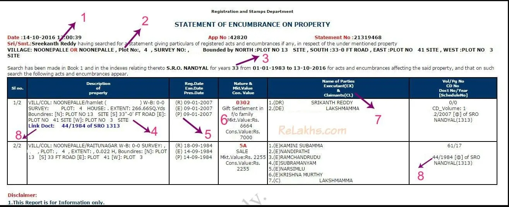

To download/ view EC document we can use online website

### Information we need:

1. Document Number
2. Registration Year
3. Registration at SRO (*Sub-Registrar Office*) registration → Bangarupalyam code - 1001

### EC Explanation 

1. You can get to know who has applied for the EC statement. If you have applied for it, you will find your name here.
2. The property details that you have provided in the Form 22 (EC application form) will be mentioned here.
3. You can notice the number of years for which the EC has been sought. I have searched for the encumbrances for the last 33 years.
4. EC will give you the complete property description as recorded in the Sale Deeds which are registered and recorded in the books of Sub-Registrar office.
5. You can get to know how many transactions have been done on the said property. The transactions are listed in a chronological order (date-wise). In this example, there were two transactions done. (R, E & P stand for Registration Date, Executed on, Presented on respectively)
6. In 1984, my grandmother bought this plot. In 2007, she has executed Gift Deed in my name. Like wise, if you are buying a property which has home loan on it (home loan taken by current owner), you can find ‘mortgage’ details instead of ‘gift settlement’ in this column. Another example can be – let’s say if partners of a firm mutually purchased the property and one of the partner wants to release his share from the property then in that case, Release Deed can be executed and registered. In this case, you can find ‘Release Deed’ details in EC.
7. You can find the name(s) of the buyer and the seller (E – Executor/Seller & C – Claimant/Receiver/Buyer). If the property is a jointly held one, you can find multiple owners.
8. If there are multiple transactions done, all of them will be inter-linked in the Registration Dept’s database. For example- the first transaction has a Registered document number as 44/1984 and the same is linked to the second transaction (Gift settlement). So, if you see these kind of links in your EC, you can request for the copies of all Link Documents (including the Mother Deed) from your Seller/Builder. In this way, you can establish the continuity of parent documents with child documents.

Reference:  [Encumbrance Certificate: How to get Property EC? Important Details](https://www.relakhs.com/encumbrance-certificate-property-ec/)

